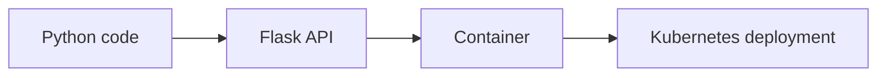

# NHS Number API

> AI generated code for NHS RPySoc2025 demo - **do not use**



A FastAPI web wrapper around the `nhs_number` Python package, with Container and kubernetes specifications.

## Installation (local)

```bash
uv venv
source .venv/bin/activate
uv pip install -e .
```

## Usage (local)

Run the application using the project entry point. The package provides a CLI entry, but you can also run the app directly with Uvicorn/uv:

```bash
uv run nhs-number-api
# or, if the `uv` CLI isn't available, use uvicorn directly:
uvicorn nhs_number_api.main:app --host 0.0.0.0 --port 8888
```

Open http://127.0.0.1:8888 to view the API and the automatically generated OpenAPI docs.

## Container (build & run)

This repository includes a `Containerfile` that builds a non-root, read-only-friendly image. Example commands to build and run locally:

```bash
# Build the image (from repo root)
docker build -f Containerfile -t nhs-number-api:v0.0.1 .

# Run the container with a read-only root filesystem
docker run --rm -p 8888:8888 \
	--read-only \
	nhs-number-api:v0.0.1
```

<!-- For MacOS:
```bash 
docker buildx build \
  --platform linux/amd64,linux/arm64 \
  --push \
  -t ghcr.io/amadeuspzs/nhs-number-api/nhs-number-api:v0.0.1 \
  -f Containerfile .
```
-->	

Open http://127.0.0.1:8888 to view the API and the automatically generated OpenAPI docs.

## Container (push)

You'll need to tag and push the locally built container next (replace registry/path accordingly):

```bash
docker tag nhs-number-api:v0.0.1 ghcr.io/amadeuspzs/nhs-number-api/nhs-number-api:v0.0.1
docker push ghcr.io/amadeuspzs/nhs-number-api/nhs-number-api:v0.0.1
```

## Kustomize

This repository includes a `k8s/` directory with Kubernetes manifests and a `kustomization.yaml` that applies them in the correct order (namespace first).

To deploy the app with kustomize (recommended for grouped resources):

```bash
# Apply everything using kustomize which reads k8s/kustomization.yaml
kubectl apply -k k8s/
```